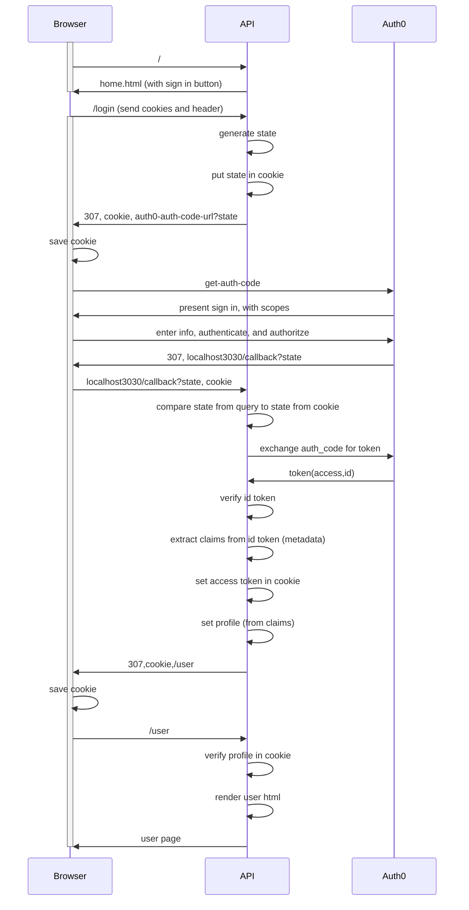

# Auth0 + Go Web App Sample

This sample demonstrates how to add authentication to a Go web app using Auth0.

Check the [Go Quickstart](https://auth0.com/docs/quickstart/webapp/golang) to better understand this sample.



## Running the App

To run the app, make sure you have **go** installed.

Rename the `.env.example` file to `.env` and provide your Auth0 credentials.

```bash
# .env

AUTH0_CLIENT_ID={yourClientId}
AUTH0_DOMAIN={yourDomain}
AUTH0_CLIENT_SECRET={yourClientSecret}
AUTH0_CALLBACK_URL=http://localhost:3000/callback
```

Once you've set your Auth0 credentials in the `.env` file, run `go mod vendor` to download the Go dependencies.

Run `go run main.go` to start the app and navigate to [http://localhost:3000/](http://localhost:3000/).

## What is Auth0?

Auth0 helps you to:

- Add authentication with [multiple authentication sources](https://auth0.com/docs/authenticate/identity-providers), either social like **Google, Facebook, Microsoft Account, LinkedIn, GitHub, Twitter, Box, Salesforce, amont others**, or enterprise identity systems like **Windows Azure AD, Google Apps, Active Directory, ADFS or any SAML Identity Provider**.
- Add authentication through more traditional **[username/password databases](https://auth0.com/docs/authenticate/database-connections/custom-db/create-db-connection)**.
- Add support for **[linking different user accounts](https://auth0.com/docs/manage-users/user-accounts/user-account-linking/link-user-accounts)** with the same user.
- Support for generating signed [Json Web Tokens](https://auth0.com/docs/secure/tokens/json-web-tokens) to call your APIs and **flow the user identity** securely.
- Analytics of how, when and where users are logging in.
- Pull data from other sources and add it to the user profile, through [JavaScript rules](https://auth0.com/docs/customize/rules).

## Create a free Auth0 account

1. Go to [Auth0](https://auth0.com/signup) and click Sign Up.
2. Use Google, GitHub or Microsoft Account to login.

## Issue Reporting

If you have found a bug or if you have a feature request, please report them at this repository issues section. Please do not report security vulnerabilities on the public GitHub issue tracker. The [Responsible Disclosure Program](https://auth0.com/whitehat) details the procedure for disclosing security issues.

## Author

[Auth0](https://auth0.com)

## License

This project is licensed under the MIT license. See the [LICENSE](LICENSE.txt) file for more info.
